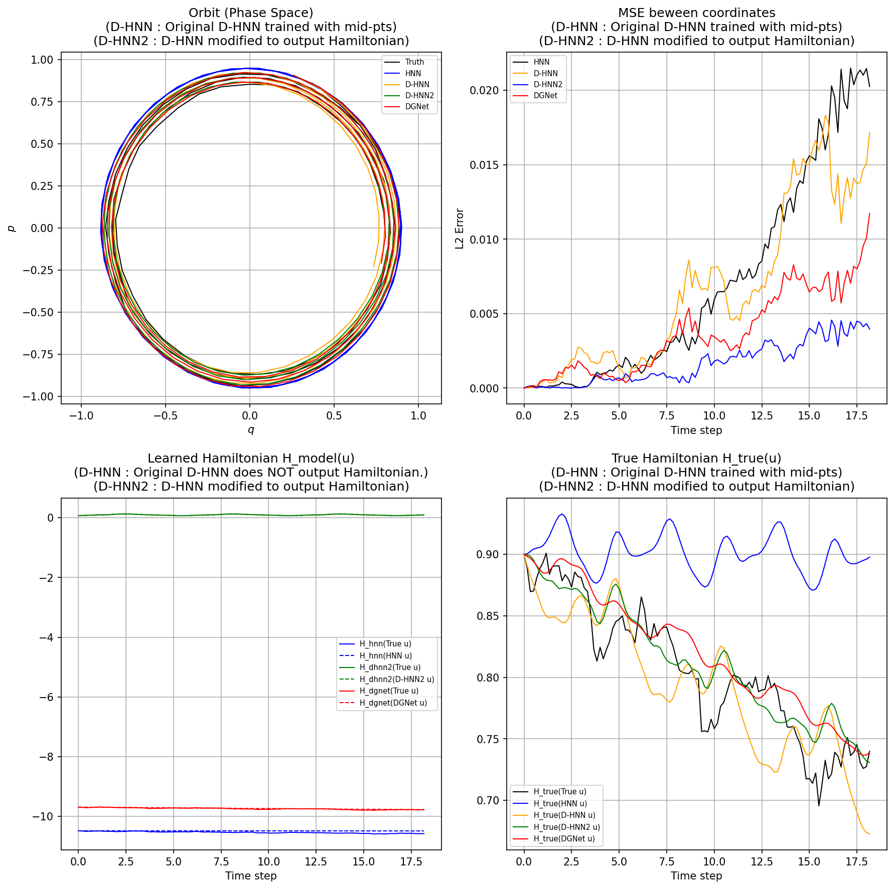

# Comprehensive Comparison of Hamiltonian-based Neural Networks

This directory focuses on benchmarking various Hamiltonian-NN architectures. Currently, it features a detailed comparative analysis using real-world data, with plans to expand to classical synthetic problems.

## The 'experiment-real' Benchmark
The **'experiment-real'** problem serves as a good example where HNN, D-HNN, and DGNet can all be evaluated and compared simultaneously. 

To enable a rigorous energy-level comparison, I used a **slightly modified version of D-HNN** (referred to as D-HNN2 in the code). While the original D-HNN is restricted to vector field outputs, this modified version is designed to output explicit Hamiltonian values, allowing for an 'Apple-to-Apple' comparison of learned energy landscapes across the entire HNN family.

## 📊 Current Progress: Evaluation Results
The current results focus on the **'experiment-real'** problem, visualized in a 2x2 subplot comparison:

*The figure demonstrates how HNN, D-HNN, D-HNN2, and DGNet interpret the dynamics and energy of the real-world pendulum.*

## 🚀 Future Updates (Work in Progress)
The following experiments are being organized and will be uploaded soon. These primarily focus on the comparison between **HNN** and **DGNet**:
- **experiment-2body/**: Orbit and energy conservation tests on the 2-body problem.
- **experiment-pend/**: Benchmark on the ideal (frictionless) pendulum system.

## 📂 Weights & Data
- **'experiment-real'** weights: `experiment-real/weights/`
- **'experiment-real'** dataset: `experiment-real/invar_datasets.zip`

