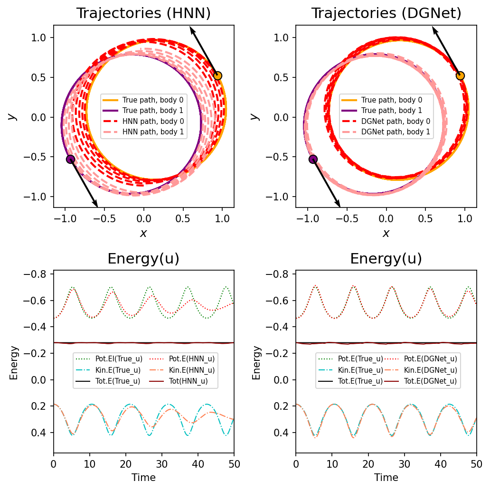

# Comparing Hamiltonian-based Neural Networks

This directory is for comparing various Hamiltonian-NN architectures. It currently shows comparisons using both real-world and synthetic data, ensuring all experiments are conducted under identical datasets and GPU contexts.

## 💡 The 'experiment-real' example
The **'experiment-real'** case is a good example where HNN, D-HNN, and DGNet can all be compared together.

To compare their energy values directly, I used a **slightly modified version of D-HNN** (referred to as D-HNN2 in the code). While the original D-HNN only outputs vector fields, I modified it to output explicit Hamiltonian values, making it possible to compare the energy results across the models on the same basis.

## 📊 Comparison results (Real-world)
The results for the **'experiment-real'** case are shown in the 2x2 subplot below:

*The figure shows how HNN, D-HNN, D-HNN2, and DGNet interpret the dynamics and energy of the real-world pendulum.*

## 💡 The 'experiment-2body' example
The **'experiment-2body'** case focuses on the orbit and energy conservation tests in the 2-body problem. This experiment specifically compares **HNN** (by Sam Greydanus et al.), implemented as HNN2 for GPU compatibility, and **DGNet** (by Takashi Matsubara et al.).

To ensure a fair comparison, both models were trained under the exact same GPU context and random seed, following a rigorous verification process to ensure HNN2 perfectly reproduces the original HNN's training path.

## 📊 Comparison results (2-body Orbit)
The result below highlights the superior trajectory stability of DGNet compared to HNN:

*The plot shows one of the 15 test cases (Case #2), where DGNet maintains a more stable orbit thanks to its discrete gradient-based energy conservation than HNN. Each plot includes scatter points for the starting positionㄴ and quiver arrows for the initial motion directions.*

## 🚀 Future updates
The following cases are being organized and will be added later:
- **experiment-pend/**: Benchmark on the ideal (frictionless) pendulum system focusing on symplectic integrators.

## 📂 Weights & Data
- **'experiment-real'**:
    - Weights: `experiment-real/weights/`
    - Dataset: `experiment-real/invar_datasets.zip`
- **'experiment-2body'**:
    - Weights: `weights/` (Includes HNN2 and DGNet checkpoints)
    - Dataset: `experiment-2body/2body-orbits-dataset.pkl`
    - Verification Logs: `experiment-2body/*.log` (Confirming HNN/HNN2 consistency)
