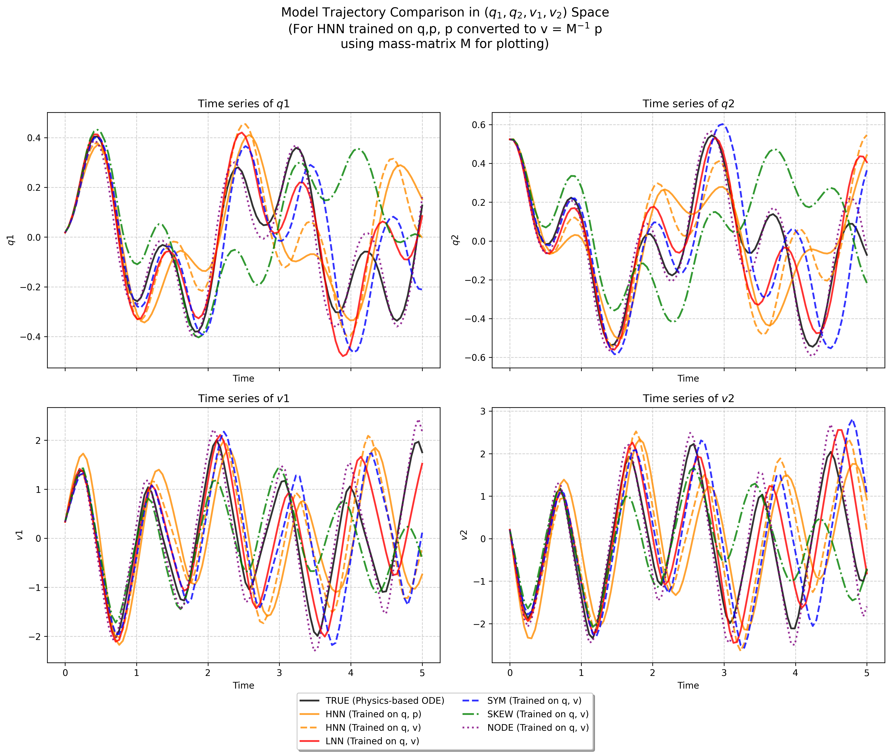

# Underfitting Issue Resolved: Decoupled Data Normalization
**- by Jae Hoon (Daniel) Lee**

This directory contains the implementation of neural symplectic form models with a revised data normalization strategy. The primary goal of this version is to resolve the artificial underfitting caused by flawed preprocessing, allowing the models to demonstrate their inherent performance.

## The Fix: Decoupled Scaling

To prevent feature distortion identified in the original codebase, the normalization process is now properly decoupled:
- **Input Scaling:** Normalized using the `max_abs` value of the **input set** independently.
- **Target Scaling:** Normalized using the `max_abs` value of the **target set** independently.

## Results of the Fix
By applying this decoupled scaling, the "strange" artifacts in evaluation have disappeared. The core improvements are as follows:
- **Fair Performance Reflection:** The prediction results now properly reflect the actual learning capacity of the models (HNN, LNN, etc.), free from preprocessing-induced errors.
- **Improved Convergence:** Models no longer suffer from the severe artificial underfitting that previously hindered the training process.
- **Evaluation Validity:** While model-specific limitations may still exist, the evaluation trajectories now provide a reliable basis for assessing the true performance of each architecture.

## Visualization of fixed underfit issue

The following figures show that the underfitting and normalization issues have been successfully resolved, demonstrating the true performance across various models.

### Mass-Spring System

### Double Pendulum System

## Technical Background
For a detailed analysis of why the original code failed and how the issue was identified, please refer to the documentation in the sibling directory:

👉 **[Analysis of Original Issue](../underfit-issue-in-asis-neural_symplectic_form-git-codes/README.md)**

---
*This version ensures that the evaluation results are a true representation of the model's architectural performance.*

