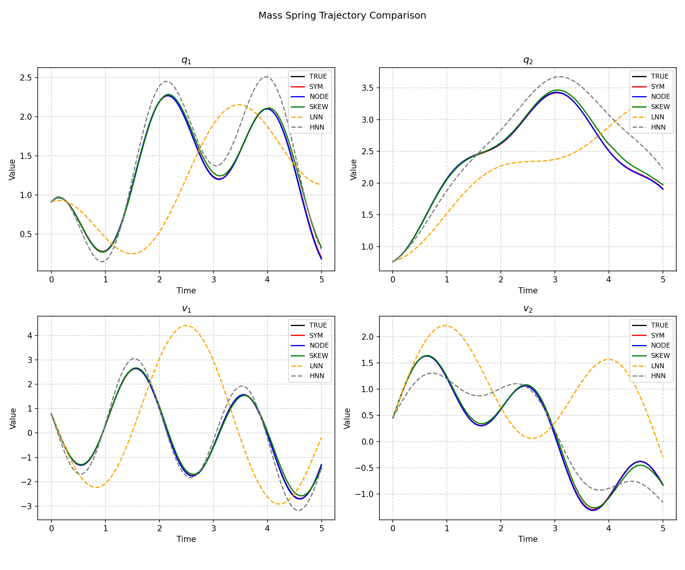

# What I found in the original neural_symplectic_form git codes
**- by Jae Hoon (Daniel) Lee**

While training and evaluating the original [neural_symplectic_form](https://github.com/YuhanChen0805/neural_symplectic_form) repository (by Y. Chen), I came to realize that the models (specifically **HNN** and **LNN**) suffer from significant underfitting. This document records the discovery that the issue is rooted in the data preprocessing stage rather than the model architecture or training code itself.

## Identified Issue: Flawed Data Normalization

During the evaluation process, a critical flaw in the data normalization strategy was identified:
- **As-is Strategy:** The code calculates the `max_abs` value of the **target set** only, and then applies this same scale matrix to both the **input set** and the **target set**.
- **The Impact:** This mismatched scaling leads to severe underfitting. Since input and target distributions often differ in magnitude, forcing the input to follow the target's scale distorts the feature representation. This issue is most prominent in **HNN** and **LNN**.

## Findings
Discovered data normalization flaws that led to poor training results, hindering a fair comparison between the Neural Symplectic Form and the genuine performance of other models.

## Visual data showing the underfit issue in as-is codes
The following figures demonstrate how the "as-is" models failed to capture the true orbits due to data issues.

### Mass-Spring System

### Double Pendulum System

## Proposed Solution & Verification

I found that separating the normalization constants for inputs and targets resolves the issue.
- **Improved Strategy:** 
  1. Calculate `max_abs` of the **input set** $\rightarrow$ Scale inputs.
  2. Calculate `max_abs` of the **target set** $\rightarrow$ Scale targets.
- **Result:** After applying this decoupled normalization, the "strange" evaluation artifacts disappeared, and the models achieved reliable, high-fidelity results.

## Comparative Results

All comparative evaluation codes, trained weights, and visualization plots demonstrating this fix are available in the sibling directory:

👉 **[View Corrected Implementation & Results](../assess-neural-symplectic-form/)**

In the linked directory, you can find:
- **Dataset Preparation:** Corrected normalization logic.
- **Trained Weights:** Models trained with the improved strategy.
- **Evaluation Plots:** Clear comparisons showing the recovery of model performance compared to the underfitted original versions.

